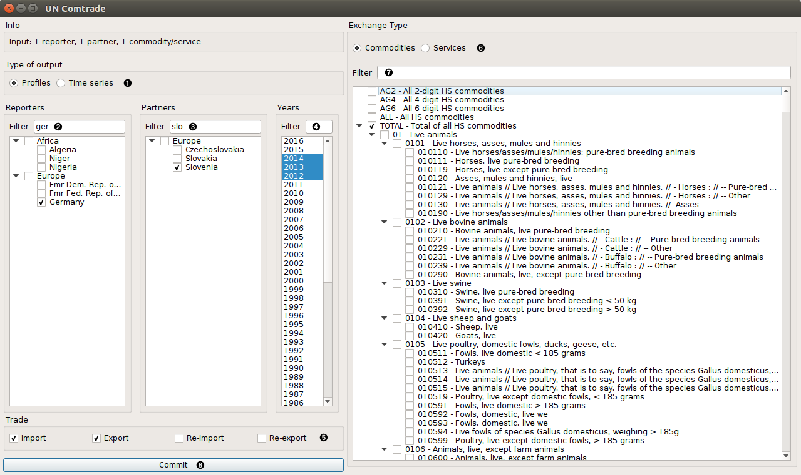
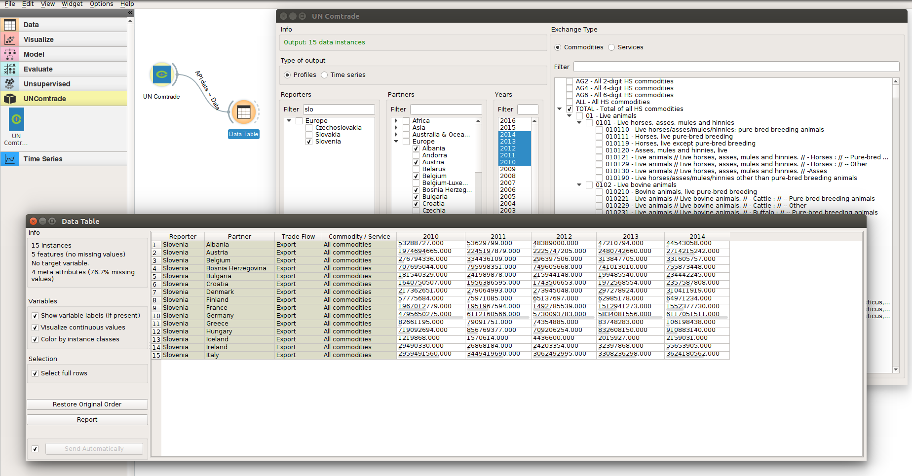

UN Comtrade
===========

UN Comtrade

Signals
-------

**Inputs**:

-  (None)

**Outputs**:

-  **Data**

   Attribute-valued data set (Orange.data.Table).

Description
-----------

This widget offers possibility to get data from UN Comtrade REST API
in such form that you are able to use it with other Orange widgets.

1. Choose whether you want your output as countries profiles or time series.

2. Filter and select reporting country/countries.

3. Filter and select partner country/countries.

4. Filter and select years.

5. Check wanted reporter trade flows.

6. Choose whether you want to select commodities or services.

7. Filter and select commodities or services.

8. Press *Commit* button to get data and send signal to output.

Examples
--------

In the screenshot below, you can see how UN Comtrade widget is connected to Data Table widget.
First, you select what trade data you want and then you get the output as shown in Data Table.

