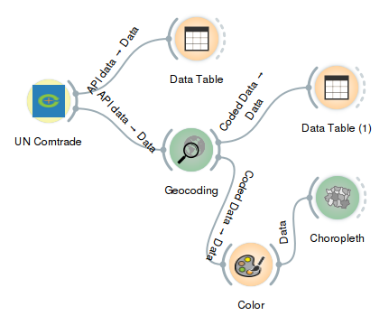
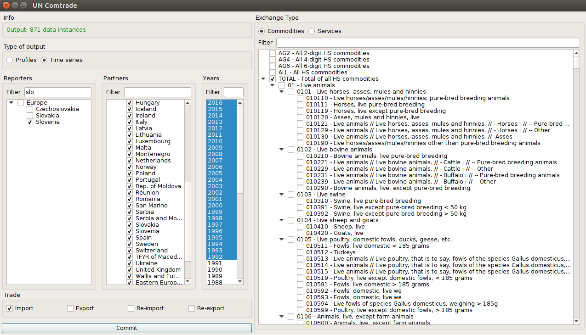

UN Comtrade
===========

.. figure:: icons/uncomtrade.png

UN Comtrade

Signals
-------

**Inputs**:

-  (None)

**Outputs**:

-  **Data**

   Attribute-valued data set (Orange.data.Table).

Description
-----------

This widget offers possibility to get data from UN Comtrade REST API
in such form that you are able to use it with other Orange widgets.

.. figure:: images/widget-stamped.png

1. Choose whether you want your output as countries profiles or time series.

2. Filter and select reporting country/countries.

3. Filter and select partner country/countries.

4. Filter and select years.

5. Check wanted reporter trade flows.

6. Choose whether you want to select commodities or services.

7. Filter and select commodities or services.

8. Press *Commit* button to get data and send signal to output.

Examples
--------

In the screenshot below, you can see how UN Comtrade widget is connected to Data Table widget.
First, you select what trade data you want and then you get the output as shown in Data Table.

With the data output from UN Comtrade widget you can prepare nice visualizations with 'Choropleth' widget.
You can use the Orange workflow shown below. To get the same visualization as shown on picture you
should select UN Comtrade widget parameters as seen in picture and use 'Edit Domain' widget
before 'Geocoding' to remove differences between countries names in UN Comtrade database and 'Geocoding' expectations
(for example Rep. of Moldova and Moldova).

.. figure:: images/geo_slo_import_from_eu.png

