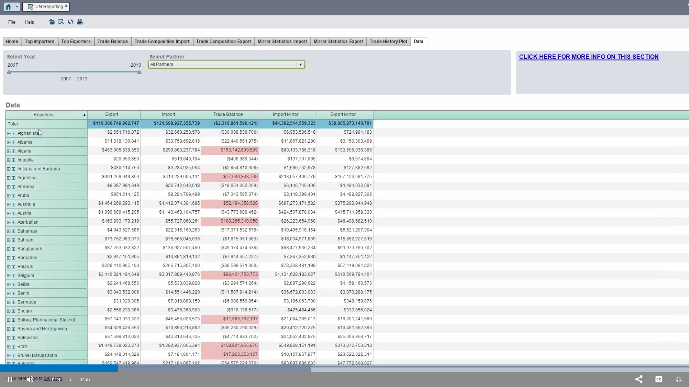
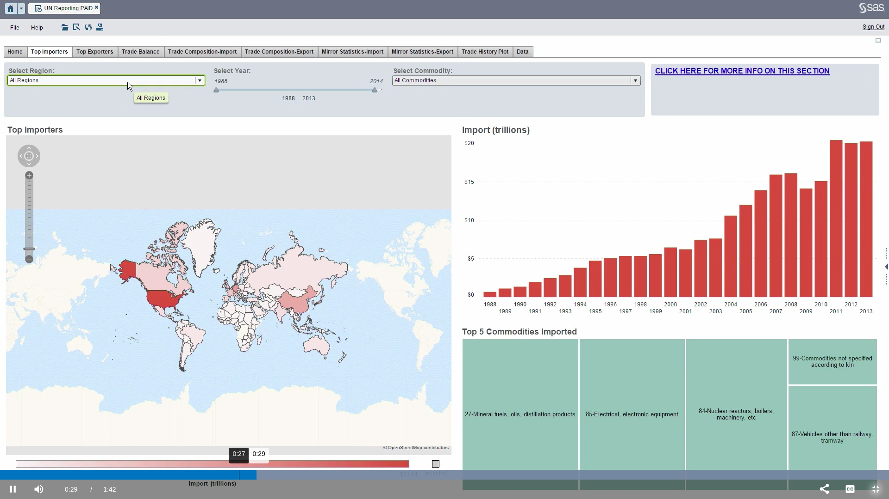
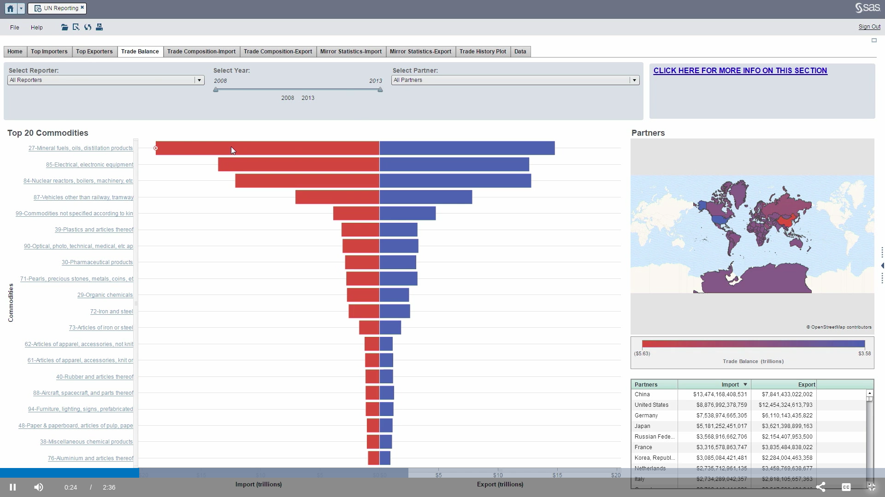
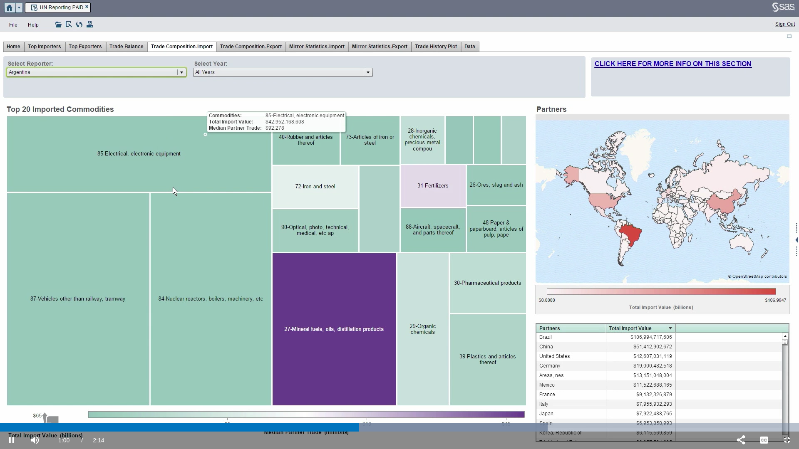
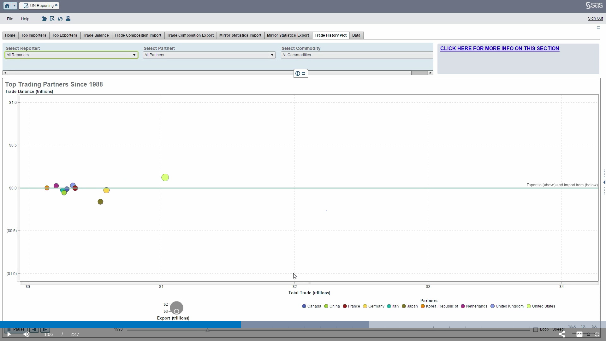
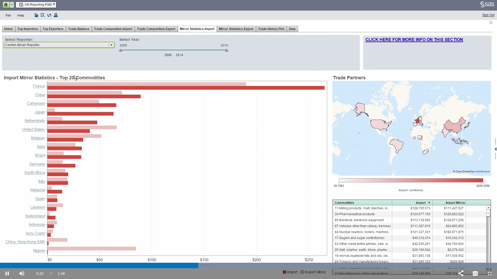

## Use of UN Comtrade API to get data from pictures

### Data


Inputs:
* partner
* time period

Example call (partner is Slovenia for 2010-2012):
```python
unc.call_api('All', 'Slovenia', [2010, 2011, 2012], 'All')
```
***


### Top importers


Inputs:
* region -> reporters
* time period
* commodities

Example call (reporters are Slovenia, Croatia, Italy, Austria, Hungary for 2009-2011 on live animals):
```python
unc.call_api(['Slovenia', 'Croatia', 'Italy', 'Austria', 'Hungary'], 'All', [2009,2010,2011], 'Import', commodities='01 - Live animals')
```

For top 5 imported commodities the call would be (then we would need to search for top 5):
```python
unc.call_api(['Slovenia', 'Croatia', 'Italy', 'Austria', 'Hungary'], 'All', [2009,2010,2011], 'Import', commodities='AG2 - All 2-digit HS commodities')
```
***


### Trade balance


Inputs:
* reporters
* time period
* partners

Example call (reporters are Austria and Germany, partner is France, data for 2009):
```python
unc.call_api(['Germany', 'Austria'], 'France', 2009, ['Import', 'Export'], commodities='TOTAL - Total of all HS commodities')
```

For top 20 commodities the call would be (then we would need to search for top 20):
```python
unc.call_api(['Germany', 'Austria'], 'France', 2009, ['Import', 'Export'], commodities='AG2 - All 2-digit HS commodities')
```
***


### Trade composition


Inputs:
* reporter
* year

Example call (reporter is France, year 2007):
```python
unc.call_api('France', 'All', 2007, 'Import', commodities='AG2 - All 2-digit HS commodities')
```
***


### Trade history


Inputs:
* reporter
* partner
* commodity

Example call (reporter is Australia, all partners, all commodities):
```python
unc.call_api('Australia', 'All', [2010,2011,2012,2013,2014], ['Import', 'Export'], commodities='TOTAL - Total of all HS commodities')
```
If we wanted details for more than five years, we should make more API calls and aggregate data afterwards.
***


### Mirror statistics


Inputs:
* reporter
* time period

Example calls (reporter is Slovenia, years 2006):
```python
unc.call_api('Slovenia', 'All', 2006, 'Import', commodities='TOTAL - Total of all HS commodities')
unc.call_api('All', 'Slovenia', 2006, 'Export', commodities='TOTAL - Total of all HS commodities')
```
After that we should compare results of both calls.
***

